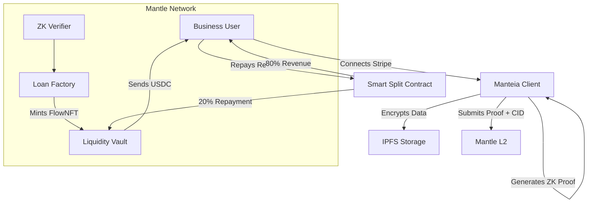

# Manteia - The Native Bank for the AI Era
  
**Website**: [https://manteia.xyz](https://manteia.xyz)


## Table of Contents

- [Overview](#overview)
- [Architecture](#architecture)
  - [Mantle Network (L2)](#mantle-network-l2)
  - [The "Blind Oracle" (ZK)](#the-blind-oracle-zk)
  - [FlowNFT](#flownft)
  - [Smart Splits](#smart-splits)
- [Features](#features)
- [Run](#run)

## Contact Us
**Website**: [https://manteia.xyz](https://manteia.xyz)


## Overview
**Revenue is the new Collateral.**

Manteia is the first under-collateralized lending protocol powered by **Zero-Knowledge Proofs**, built on the **Mantle Network**. It allows digital businesses (SaaS, AI startups, Solopreneurs) to convert their monthly recurring revenue (MRR) into instant, non-dilutive capital without giving up equity or doxxing their private customer data.

The project addresses the **$5 Trillion Funding Gap** where digital natives have high cash flow but no physical assets (factories/land) to secure bank loans, and refuse to share sensitive customer lists with Fintech lenders.

- **Non-Dilutive**: Keep 100% of equity.
- **Private**: "Truth-Based Financing" verifies *that* you are profitable without revealing *who* your customers are.
- **Instant**: Algorithmic underwriting via API integration.


## Architecture

Manteia combines off-chain privacy (ZK) with on-chain transparency (Mantle L2).

### Manteia Architecture Diagram


### Mantle Network (L2)
All financial logic lives on Mantle Sepolia.
- **Contracts**: `LendingVault`, `ManteiaFactory`, `MockUSDC`.
- **Why Mantle?**: Low gas fees enable complex verify functions for ZK proofs, and $USDY integration allows the liquidity vault to earn native financing yield on idle capital.

### The "Blind Oracle" (ZK)
We use a **Circom** circuit running in the browser (via `snarkjs`) to generate a proof of revenue.
- **Input**: Signed API response from Stripe (Private).
- **Circuit Logic**: `assert(avg_mrr_6m > threshold)` AND `assert(churn_rate < max_churn)`.
- **Output**: A simple Boolean and a computed Risk Score. No raw data ever touches the chain.

### FlowNFT
Successful verification mints a dynamic **ERC-721 Token** representing the future cash flows.
- **Tradable**: Can be sold on secondary markets.
- **Composable**: Can be used as collateral in other DeFi protocols.

### Smart Splits
Repayment is enforced at the source. Borrowers deploy a legal wrapper contract (fork of **0xSplits**) that automatically diverts a fixed percentage of incoming revenue to the Lending Vault until the loan principal + interest is satisfied.


## Features

### 1. ZK Verification Modal


Seamlessly connects to Stripe, calculates credit limits locally, and generates proofs in ~10 seconds.

### 2. Lender Dashboard


Lenders can browse anonymized "Grade A" loan opportunities, view real-time APY (12-18%), and manage their liquidity positions.

### 3. Live Transaction Feed
Real-time tracking of deposits, withdrawals, loan funding events, and repayments via Supabase integration.


## Run

To run Manteia locally, you need the following environment variables in `.env.local`:

```bash
# 1. Mantle Network
MANTLE_RPC_URL=https://rpc.sepolia.mantle.xyz
PRIVATE_KEY=your_deployer_key

# 2. Third Party Keys
NEXT_PUBLIC_WALLETCONNECT_PROJECT_ID=your_id
NEXT_PUBLIC_SUPABASE_URL=your_supabase_url
NEXT_PUBLIC_SUPABASE_ANON_KEY=your_supabase_key
PINATA_JWT=your_pinata_jwt

# 3. Contract Addresses (Auto-updated by deploy scripts)
NEXT_PUBLIC_MOCK_USDC_ADDRESS=...
NEXT_PUBLIC_VERIFIER_ADDRESS=...
NEXT_PUBLIC_LENDING_VAULT_ADDRESS=...
NEXT_PUBLIC_MANTEIA_FACTORY_ADDRESS=...


```

### Steps

```bash
# STEP 1: Install Dependencies
pnpm install

# STEP 2: Deploy Contracts (Mantle Sepolia)
npx hardhat run scripts/deploy_upgrade.js --network mantleTest

# STEP 3: Run Development Server
pnpm dev
# Open http://localhost:3000
```
